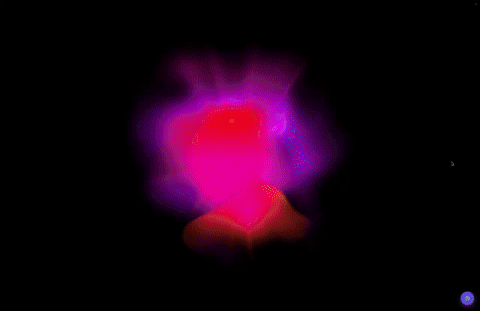

# Music Shader Animation

Audio-reactive WebGL shader animation built with the [OGL](https://github.com/oframe/ogl) library (WebGL) and Vue 3 + TypeScript. Inspired by the general aesthetics of music visualizers.

An original, from-scratch implementation of a generic audio-reactive visual effect. Contains no third-party logos, branding, or proprietary code. **For educational and portfolio purposes only.**



## Features

- 🎨 WebGL shader animation rendered via the lightweight OGL library
- 🎵 Reacts to live audio frequencies (low / middle / high bands)
- 🌈 Configurable color palette (`hue` / `collectionHue`)
- ⚡ Energy, background brightness and monochrome modes
- 📱 Automatic platform detection with a performance-friendly **LITE** mode on Android
- 🔁 Robust lifecycle handling: WebGL context loss/restore, pause/resume, full teardown
- 🧩 Framework-agnostic core (`MusicAnimationCore`) usable without Vue

## Tech Stack

- **Vue 3** (`<script setup>`, Composition API)
- **TypeScript**
- **Vite** (dev server / build)
- **OGL** (WebGL rendering)
- **Tailwind CSS 4** (dev dependency)

## Getting Started

### Prerequisites

- [Node.js](https://nodejs.org/) 18+ (LTS recommended)
- npm (bundled with Node.js)

### Clone & Run

```bash
# 1. Clone the repository
git clone https://github.com/izum-vinipuhov/music-shader-animation.git
cd music-shader-animation

# 2. Install dependencies
npm install

# 3. Start the dev server
npm run dev
```

Open the URL printed by Vite (default: `http://localhost:5100`).

### Build for Production

```bash
npm run build     # type-check + bundle into dist/
npm run preview   # preview the production build locally
```

## Usage

The project ships with a demo page (`src/App.vue`) that lets you upload an audio file, play it, and watch the shader react to the music in real time. You can also embed the animation in your own app.

### Vue Component

```vue
<script setup lang="ts">
import { ref } from 'vue'
import MusicAnimation from '@/components/MusicAnimation.vue'
import type { AudioFrequencies } from '@/lib/uniforms'

const animationRef = ref<InstanceType<typeof MusicAnimation> | null>(null)

// Push live audio data (e.g. from a Web Audio AnalyserNode)
function feed(f: AudioFrequencies) {
  animationRef.value?.updateAudioFrequencies(f)
}
</script>

<template>
  <MusicAnimation
    ref="animationRef"
    :size="600"
    mode="square"
    :hue="200"
    :collection-hue="10"
    :energy="1"
    :background-color="0.07"
    :monochrome="false"
    :is-playing="true"
  />
</template>
```

#### Props

| Prop               | Type                         | Default     | Description                                                        |
|--------------------|------------------------------|-------------|--------------------------------------------------------------------|
| `hue`              | `number`                     | `200`       | Base hue (0–360) driving the top/middle colors.                    |
| `collectionHue`    | `number`                     | `10`        | Secondary hue (0–360) driving the bottom colors.                   |
| `energy`           | `number`                     | `1`         | Animation intensity / speed.                                       |
| `isPlaying`        | `boolean`                    | `true`      | Plays (active) or idles (calm) the animation.                      |
| `isMobile`         | `boolean`                    | `false`     | Switches to the mobile layout scale.                               |
| `backgroundColor`  | `number`                     | `0.07`      | Background brightness, `0`–`1` (ignored in monochrome mode).       |
| `monochrome`       | `boolean`                    | `false`     | Single-color mode with a darkened matching background.             |
| `transparent`      | `boolean`                    | `false`     | Transparent canvas background (alpha).                             |
| `state`            | `AnimationState`             | `DEFAULT`   | `DEFAULT` (3 circles) or `LITE` (2 circles, lighter).              |
| `size`             | `number \| string`           | `'100%'`    | Canvas size; number → pixels, string → CSS value.                  |
| `mode`             | `'square' \| 'fill'`         | `'square'`  | `square` renders a circle; `fill` fills the container.             |
| `audioFrequencies` | `AudioFrequencies \| null`   | `null`      | Initial audio data (`{ low, middle, high }`, each `0`–`1`).        |
| `shaderOptions`    | `Partial<ShaderOptions>`     | `—`         | Advanced shader/canvas options.                                    |

#### Exposed Methods

Access via a template ref (`animationRef.value?.method()`):

| Method                          | Description                                                       |
|---------------------------------|-------------------------------------------------------------------|
| `updateAudioFrequencies(f)`     | Feed new audio band values (`{ low, middle, high }`).             |
| `applySettings(args)`           | Update `hue`, `collectionHue`, `energy`, `backgroundColor`, `baseScale`. |
| `likeAnimation()`               | Trigger the "like" reaction burst.                               |
| `pause()`                       | Stop rendering without destroying the WebGL context.            |
| `resume()`                      | Resume rendering after a `pause()`.                             |
| `destroy()`                     | Fully tear down: stop render, free GPU resources, drop context. |

### Core Class (Framework-Agnostic)

The animation core lives in `src/lib/animation.ts` and can be used without Vue — just hand it a `<canvas>`.

```ts
import { MusicAnimationCore, AnimationState } from '@/lib/animation'

const animation = new MusicAnimationCore({
  canvas: document.querySelector('canvas')!,
  state: AnimationState.DEFAULT,
  collectionHue: 10,
  monochrome: false,
  shaderOptions: { transparent: false },
  onError: (e) => console.error(e),
  // If true, the host controls pause()/resume() instead of the
  // class subscribing to visibilitychange/pagehide/pageshow itself.
  manageLifecycleExternally: true,
})

// Configure colors & intensity
animation.applySettings({ hue: 200, collectionHue: 10, energy: 1, backgroundColor: 0.07 })

// Desktop / mobile layout
animation.updateLayout(false)

// Start the active animation
animation.playAnimation({ hue: 200, energy: 0.6, collectionHue: 10 })

// ...or calm idle mode
// animation.idleAnimation()

// Feed audio frequencies each frame (values 0–1)
animation.updateAudioFrequencies({ low: 0.4, middle: 0.2, high: 0.1 })

// Pause / resume / destroy
// animation.pause()
// animation.resume()
animation.destroy()
```

#### `MusicAnimationCore` API

| Member                                  | Description                                                              |
|-----------------------------------------|--------------------------------------------------------------------------|
| `new MusicAnimationCore(config)`               | Creates the renderer (see `MusicAnimationCoreConfig`).                          |
| `applySettings(args)`                   | Apply `hue`, `collectionHue`, `energy`, `backgroundColor`, `baseScale`.  |
| `playAnimation(args?)`                  | Switch to the active (playing) state.                                    |
| `idleAnimation()`                       | Switch to the calm idle state.                                           |
| `likeAnimation()`                       | Trigger a timed "like" reaction.                                         |
| `updateAudioFrequencies(f)`             | Set the current `{ low, middle, high }` audio data.                      |
| `updateLayout(isMobile)`                | Toggle the mobile/desktop scale.                                         |
| `setMonochrome(value)`                  | Enable/disable monochrome mode (rebuilds the shader).                    |
| `enableLiteAnimation()`                 | Drop to LITE mode (fewer circles, lighter GPU load).                     |
| `enableRender()` / `disableRender()`    | Toggle the render loop.                                                  |
| `pause()` / `resume()`                  | Pause/resume rendering while keeping the WebGL context alive.            |
| `destroy()`                             | Full cleanup; the instance becomes unusable afterwards.                  |

#### Feeding Audio (Web Audio example)

Compute three normalized bands from an `AnalyserNode` and feed them every frame:

```ts
const analyser = audioCtx.createAnalyser()
analyser.fftSize = 1024
const data = new Uint8Array(analyser.frequencyBinCount)

function avg(d: Uint8Array, from: number, to: number) {
  let sum = 0
  for (let i = from; i < to; i++) sum += d[i]
  const n = to - from
  return n > 0 ? sum / n / 255 : 0
}

function loop() {
  analyser.getByteFrequencyData(data)
  const bins = data.length
  animation.updateAudioFrequencies({
    low: avg(data, 0, Math.floor(bins * 0.1)),
    middle: avg(data, Math.floor(bins * 0.1), Math.floor(bins * 0.4)),
    high: avg(data, Math.floor(bins * 0.4), bins),
  })
  requestAnimationFrame(loop)
}
loop()
```

## Project Structure

.
├── index.html
├── package.json
├── vite.config.ts
├── assets/
│   └── animation.gif
└── src/
    ├── App.vue                  # Demo page with audio player + controls
    ├── main.ts
    ├── components/
    │   └── MusicAnimation.vue   # Vue wrapper around MusicAnimationCore
    ├── lib/
    │   ├── animation.ts         # MusicAnimationCore core (renderer, lifecycle)
    │   ├── uniforms.ts          # UniformsState, palette, audio mapping
    │   ├── easing.ts            # EasedValue / EasedColor helpers
    │   └── color.ts             # HSL→RGB and hue utilities
    └── shaders/
        ├── vertex.glsl.ts
        └── fragment.glsl.ts

## Disclaimer

This is an independent project created solely for **educational and portfolio purposes**.

- The animation is an **original implementation written from scratch**, based on the general aesthetics of audio visualizers — a widely used and common type of visual effect.
- It does **not** include any third-party logos, brand names, proprietary assets, or copied source code.
- It is **not affiliated with, endorsed by, or connected to** any company or product.
- All trademarks and brand names mentioned anywhere belong to their respective owners.

If you are a rights holder and have any concerns, please open an issue and I will address it promptly.

## License

Released under the [MIT License](LICENSE).